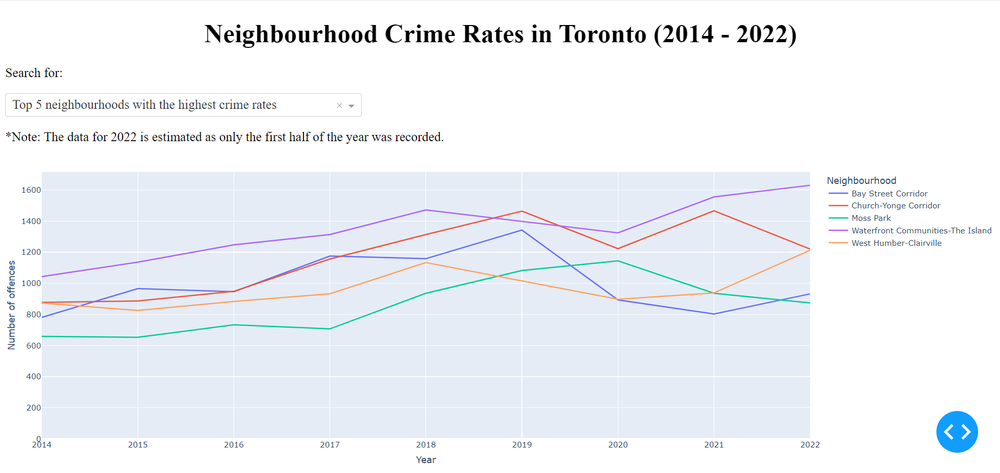

# Neighbourhood-Stats: Toronto Crime Rate Visualization
### About
Neighbourhood-Stats is a web application designed to visualize crime statistics across Toronto neighborhoods from 2014 to June 2022. This interactive tool allows users to explore crime rates in different areas of the city, providing insights into the distribution and trends over the years.

### Features
- Crime Rate Graph: Users can select from a dropdown menu to view a line graph of the top 5 neighborhoods with the highest or lowest crime rates.
- Crime Rate Map: The app features an interactive map of Toronto that displays crime rates across 140 neighborhoods. Users can hover over each area to see the neighborhood name and the number of offenses reported.
- Yearly Data Exploration: A slider allows users to select a specific year and see how crime rates have changed over time.
- Data Processing: The app uses crime data directly from the Toronto Police Service, ensuring accuracy and relevance. The data was manipulated and prepared using the Pandas, CSV, and GeoJSON libraries, allowing for efficient handling of large datasets and geographic information.

### Screenshots
Check out the app in action with some sample images below:
- Top 5 neighborhoods with the highest crime rate

- Interactive Crime Rate Map of Toronto Neighborhoods

### Getting Started
To run the app, you'll need Python installed along with the necessary libraries listed in the requirements.txt file.

